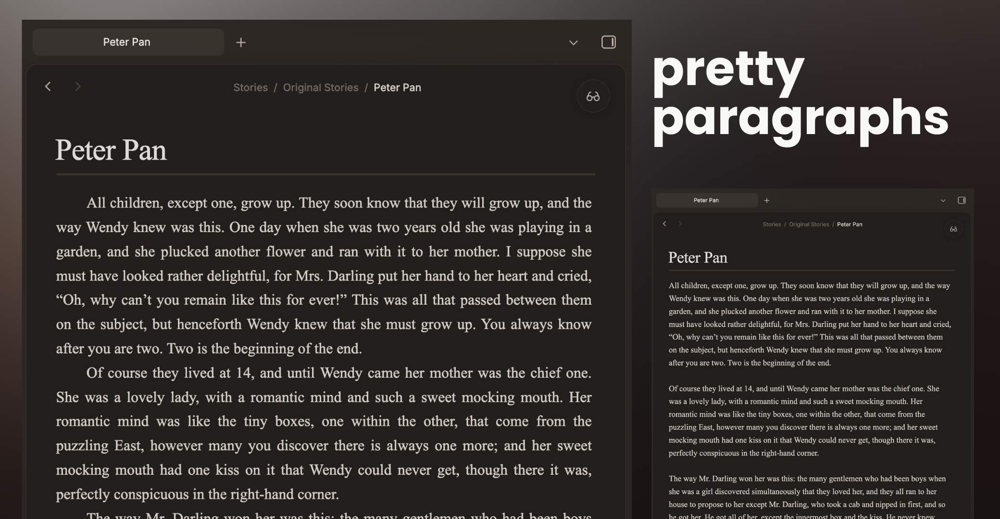

# Pretty Paragraphs

**Pretty Paragraphs** is designed to bring a novel-like look to your notes with traditional first-line indentation, all while still enforcing good markdown habits.

Enforcing good markdown habits, this plugin is designed so that a single-enter creates a new line with no indent, so you will never be confused about whether your paragraphs will be recognized in markdown.

---

## Features / Settings

- **Indents:** Enjoy beautiful, traditional indents.
- **Keep Markdown Habits:** A visible difference between line-breaks and paragraph-breaks ensures that you will always create your documents in valid markdown
- **Choose Your View**: Choose whether you want this new styling to apply in the reader view, editor view, or both!
- **Justify:** Apply justified typesetting, so your lines go end-to-end across the page
- **Whitelist:** Selectively apply these styles in the specified folder. Enjoy your novel formatting without ruining your daily notes.
- **Adjust:** Change the indent size by using the Style Settings plugin in conjunction with this one.

---

## Recommendations

This plugin pairs great with [Paragraph Break](https://community.obsidian.md/plugins/paragraph-break) by Mateusz Nitka, which will create new paragraphs with a single-enter rather than a double-enter.

_Found a bug or have a feature request? Please feel free to open an issue in the GitHub repository!_
